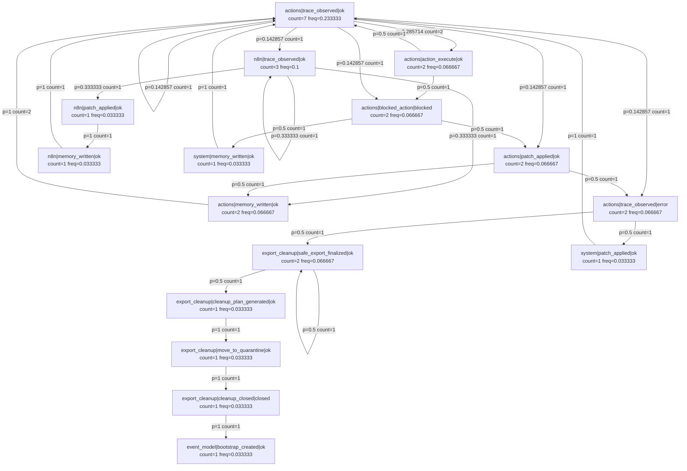

# RF_MARKOV_GRAPH_EXPORT_V1

Fecha: 2026-05-31 09:51:06

Estado: MARKOV_GRAPH_EXPORT_DONE
Modelo fuente: C:\RUNEFOGE_PRO\runeforge\data\markov\dryrun\rf_markov_model_v1_dryrun_20260531_094537.json
Estados: 16
Transiciones: 27
Policy OK: True

## Archivos generados
- Mermaid: C:\RUNEFOGE_PRO\runeforge\data\markov\graph_export\rf_markov_graph_v1_20260531_095106.mmd
- DOT: C:\RUNEFOGE_PRO\runeforge\data\markov\graph_export\rf_markov_graph_v1_20260531_095106.dot
- CSV edges: C:\RUNEFOGE_PRO\runeforge\data\markov\graph_export\rf_markov_graph_edges_v1_20260531_095106.csv
- JSON export: C:\RUNEFOGE_PRO\runeforge\data\markov\graph_export\rf_markov_graph_export_v1_20260531_095106.json
- Trace: C:\RUNEFOGE_PRO\runeforge\data\traces\rf_markov_graph_export_v1_20260531_095106.json

Backend: NO_TOCADO
PM2: NO_TOCADO
n8n: NO_TOCADO

## Top states
- actions|trace_observed|ok: 7 / freq=0.233333
- n8n|trace_observed|ok: 3 / freq=0.1
- actions|action_execute|ok: 2 / freq=0.066667
- actions|blocked_action|blocked: 2 / freq=0.066667
- actions|memory_written|ok: 2 / freq=0.066667
- actions|patch_applied|ok: 2 / freq=0.066667
- actions|trace_observed|error: 2 / freq=0.066667
- export_cleanup|safe_export_finalized|ok: 2 / freq=0.066667
- event_model|bootstrap_created|ok: 1 / freq=0.033333
- export_cleanup|cleanup_closed|closed: 1 / freq=0.033333

## Top transitions
- actions|memory_written|ok -> actions|trace_observed|ok: count=2 / p=1
- actions|trace_observed|ok -> actions|action_execute|ok: count=2 / p=0.285714
- actions|action_execute|ok -> actions|trace_observed|ok: count=1 / p=0.5
- actions|blocked_action|blocked -> actions|patch_applied|ok: count=1 / p=0.5
- actions|blocked_action|blocked -> system|memory_written|ok: count=1 / p=0.5
- actions|patch_applied|ok -> actions|memory_written|ok: count=1 / p=0.5
- actions|patch_applied|ok -> actions|trace_observed|error: count=1 / p=0.5
- actions|trace_observed|error -> export_cleanup|safe_export_finalized|ok: count=1 / p=0.5
- actions|trace_observed|error -> system|patch_applied|ok: count=1 / p=0.5
- actions|trace_observed|ok -> actions|blocked_action|blocked: count=1 / p=0.142857

## Mermaid preview

## Siguiente
- RF_MARKOV_GRAPH_REVIEW_V1
